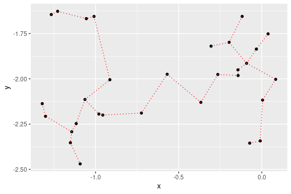
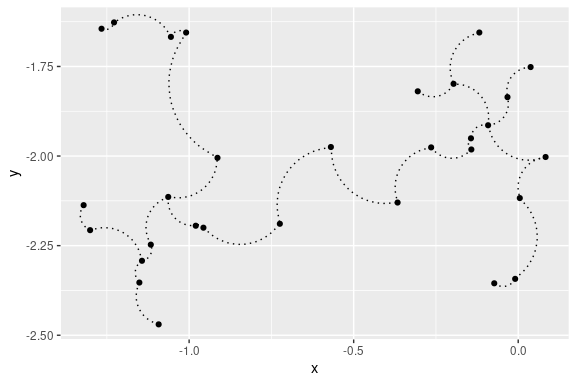
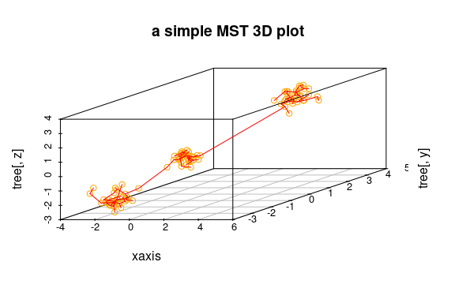
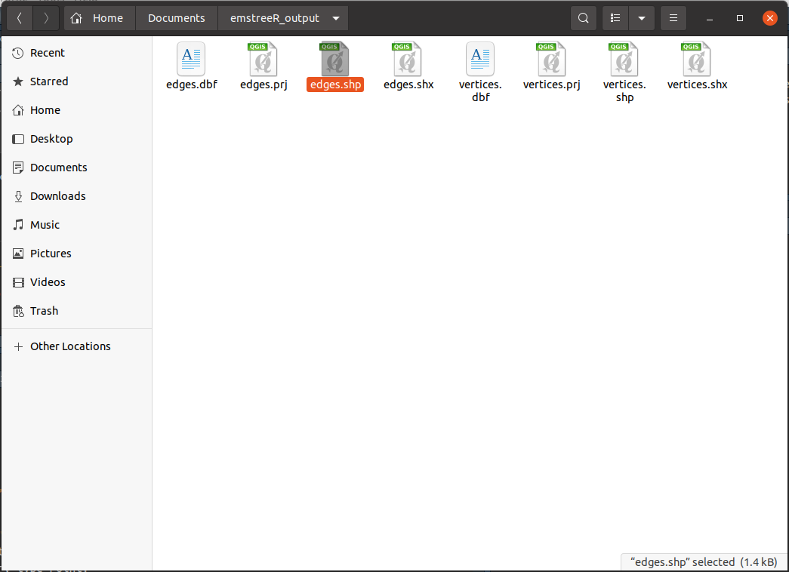
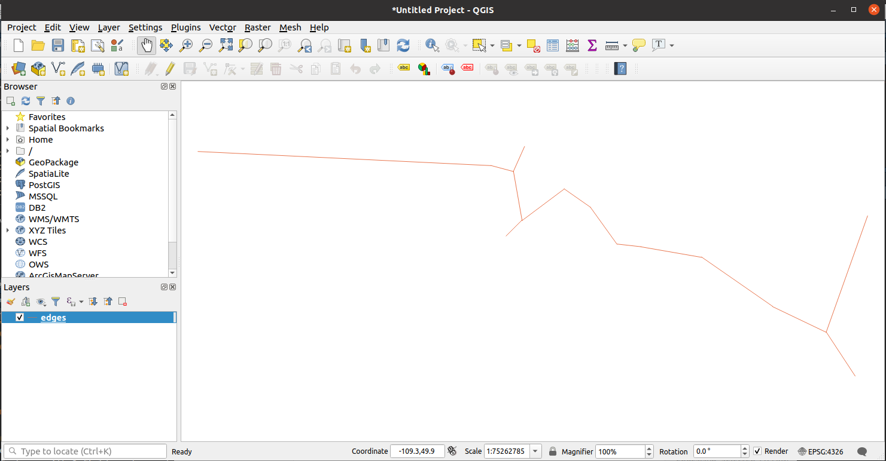
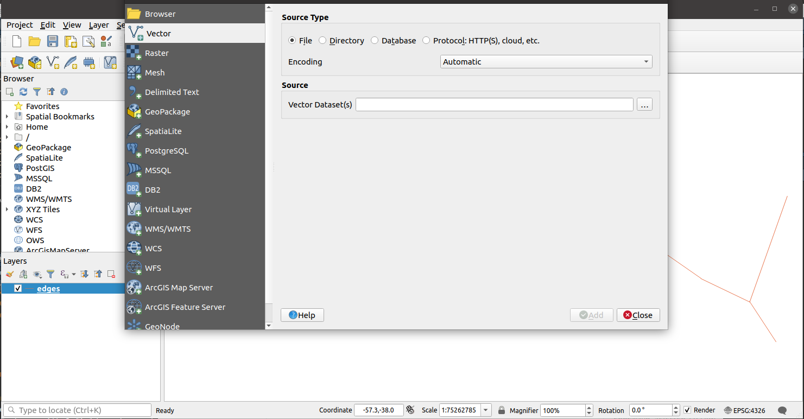
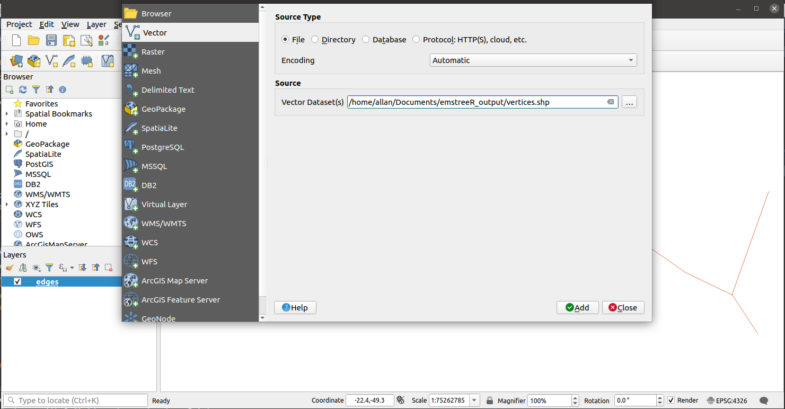

<!-- README.md is generated from README.Rmd. Please edit that file -->

# emstreeR

<!-- # emstreeR  -->
<!-- [](http://www.r-pkg.org/pkg/emstreeR) -->
<!-- one space after links to display badges side by side -->
<!-- badges: start -->

<!-- [](https://travis-ci.org/allanvc/emstreeR)  -->
[](https://cran.r-project.org/package=emstreeR)
[](https://cran.r-project.org/package=emstreeR)
[](https://opensource.org/license/bsd-3-clause/)
[](https://github.com/allanvc/emstreeR/actions/workflows/R-CMD-check.yaml)
<!-- badges: end -->

## Overview

`emstreeR` enables **R** users to fast and easily compute an Euclidean
Minimum Spanning Tree (EMST) from data. This package relies on the R API
for {mlpack} - the C++ Machine Learning Library (Curtin et. al., 2013).
{emstreeR} uses the Dual-Tree Boruvka (March, Ram, Gray, 2010,
<https://doi.org/10.1145/1835804.1835882>), which is theoretically and
empirically the fastest algorithm for computing an EMST. This package
also provides functions and an S3 method for readily plotting Minimum
Spanning Trees (MST) using either the style of the {base},
{scatterplot3d}, or {ggplot2} libraries; and functions to export the MST
output to shapefiles.

- `computeMST()` computes an Euclidean Minimum Spanning Tree for the
  input data.
- `plot.MST()` an S3 method for the generic function `plot()` that
  produces 2D MST plots.
- `plotMST3D()` plots a 3D MST using the {scatterplot3d} style.
- `stat_MST()` a {ggplot2} Stat extension for plotting a 2D MST.
- `export_vertices_to_shapefile()` writes a shapefile containing the
  `MST` vertices.
- `export_edges_to_shapefile()` writes a shapefile containing the `MST`
  edges.

## Installation

``` r
# CRAN version
install.packages("emstreeR")

# Dev version
if (!require('devtools')) install.packages('devtools')
devtools::install_github("allanvc/emstreeR")
```

## Basic Usage

``` r
## artificial data:
set.seed(1984)
n <- 7
c1 <- data.frame(x = rnorm(n, -0.2, sd = 0.2), y = rnorm(n, -2, sd = 0.2))
c2 <- data.frame(x = rnorm(n, -1.1, sd = 0.15), y = rnorm(n, -2, sd = 0.3)) 
d <- rbind(c1, c2)
d <- as.data.frame(d)

## MST:
library(emstreeR)
out <- ComputeMST(d)
out
```

    ##               x         y from to   distance
    ## 1  -0.118159357 -2.166545   11 13 0.03281747
    ## 2  -0.264604994 -2.105242    8 12 0.05703382
    ## 3  -0.072829535 -1.716803    3  7 0.08060398
    ## 4  -0.569225757 -1.943598    5  6 0.11944501
    ## 5  -0.009270527 -1.942413    6  7 0.13450475
    ## 6   0.037697969 -1.832590    8 10 0.14293342
    ## 7  -0.091509110 -1.795213    1  2 0.15875908
    ## 8  -1.097338236 -1.871078   10 14 0.16993335
    ## 9  -0.841400898 -2.194585    1  5 0.24918237
    ## 10 -1.081888729 -1.728982    8 13 0.27882008
    ## 11 -1.366334073 -2.003965    2  4 0.34485145
    ## 12 -1.081078171 -1.925745    9 12 0.36016689
    ## 13 -1.357063682 -1.972485    4  9 0.37023475
    ## 14 -0.913706515 -1.753315    1  1 0.00000000

## Plotting

### 2D Plots

``` r
## artifical data for 2D plots:
set.seed(1984)
n <- 15
c1 <- data.frame(x = rnorm(n, -0.2, sd = 0.2), y = rnorm(n, -2, sd = 0.2))
c2 <- data.frame(x = rnorm(n, -1.1, sd = 0.15), y = rnorm(n, -2, sd = 0.3)) 
d <- rbind(c1, c2)
d <- as.data.frame(d)
  
## MST:
library(emstreeR)
out <- ComputeMST(d, verbose = FALSE)
```

``` r
## simple 2D plot:
plot(out, col.pts = "red", col.segts = "blue")
```


``` r
## 2D plot with ggplot2:
library(ggplot2)
ggplot(data = out, aes(x = x, y = y, from = from, to = to))+ 
  geom_point()+ 
  stat_MST(colour="red")
```



``` r
## 2D curved edges plot with ggplot2:
library(ggplot2)
ggplot(data = out, aes(x = x, y = y, from = from, to = to))+ 
  geom_point()+ 
  stat_MST(geom="curve")
```



### 3D Plot

``` r
## artificial data for 3D plots:
n = 99
set.seed(1984)
d1 <- matrix(rnorm(n, mean = -2, sd = .5), n/3, 3) # 3d
d2 <- matrix(rnorm(n, mean = 0, sd = .3), n/3, 3)
d3 <- matrix(rnorm(n, mean = 3, sd = .4), n/3, 3)
d <- rbind(d1,d2,d3) # showing a matrix input
  
## MST:
library(emstreeR)
out <- ComputeMST(d, verbose = FALSE)
```

``` r
## simple 3D plot:
plotMST3D(out, xlab = "xaxis", col.pts = "orange", col.segts = "red", main = "a simple MST 3D plot")
```



### Exporting the Output to GIS Shapefiles

``` r
## mock data
country_coords_txt <- "
1     3.00000  28.00000       Algeria
2    54.00000  24.00000           UAE
3   139.75309  35.68536         Japan
4    45.00000  25.00000 'Saudi Arabia'
5     9.00000  34.00000       Tunisia
6     5.75000  52.50000   Netherlands
7   103.80000   1.36667     Singapore
8   124.10000  -8.36667         Korea
9    -2.69531  54.75844            UK
10    34.91155  39.05901        Turkey
11  -113.64258  60.10867        Canada
12    77.00000  20.00000         India
13    25.00000  46.00000       Romania
14   135.00000 -25.00000     Australia
15    10.00000  62.00000        Norway"
 
d <- read.delim(text = country_coords_txt, header = FALSE,
                 quote = "'", sep = "",
                 col.names = c('id', 'lon', 'lat', 'name'))
                 
## MST
library(emstreeR)
output <- ComputeMST(d[,2:3])
#plot(output)

export_vertices_to_shapefile(output, file="vertices.shp")
export_edges_to_shapefile(output, file="edges.shp")
```

Below is an example of how to open the shapefiles using the QGIS
software in Ubuntu.

Open file `vertices.shp` or `edges.shp`.




Then go to `Menu > Layer > Add Layer > Add Vector Layer`.



Select `Source Type` as `File` if it is not selected yet. Then click on
the three dots button under `Source` to select the other shapefile,
depending on which one you used to open QGIS. In the example below, we
select `vertices.shp` as we chose `edges.shp` first.





Hit `Add`, then `Close` and **voilà**.


It is then very straightforward to add other layers such map shapefiles
or add the generated EMST to existing layers.

## License

This package is licensed under the terms of the BSD 3-clause License.

## References

March, W. B., and Ram, P., and Gray, A. G. (2010). *Fast euclidian
minimum spanning tree: algorithm analysis, and applications*. 16th ACM
SIGKDD International Conference on Knowledge Discovery and Data mining,
July 25-28 2010. Washington, DC, USA.

Curtin, R. R. et al. (2013). Mlpack: A scalable C++ machine learning
library. *Journal of Machine Learning Research*, v. 14, 2013.
