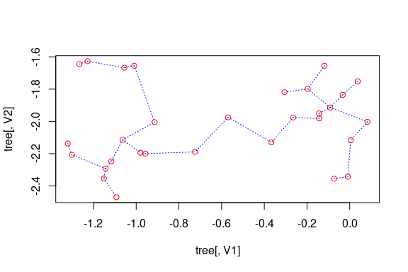

<!-- README.md is generated from README.Rmd. Please edit that file -->

# emstreeR

<!-- # emstreeR  -->

<!-- [](http://www.r-pkg.org/pkg/emstreeR) -->

<!-- one space after links to display badges side by side -->

[](https://travis-ci.org/allanvc/emstreeR)
[](https://cran.r-project.org/package=emstreeR)
[](https://cran.r-project.org/package=emstreeR)
[](https://opensource.org/licenses/BSD-3-Clause)

## Overview

`emstreeR` enables **R** users to fast and easily compute an Euclidean
Minimum Spanning Tree (EMST) from data. This package relies on
{RcppMLPACK} to provide an R interface for the Dual-Tree Boruvka
algorithm (March, Ram, Gray, 2010) implemented in mlpack, the C++
Machine Learning Library (Curtin et. al., 2013). The Dual-Tree Boruvka
is theoretically and empirically the fastest algorithm for computing an
EMST. This package also provides functions and an S3 method for readily
plotting Minimum Spanning Trees (MST) using either the style of the
{base}, {scatterplot3d}, or {ggplot2} libraries.

  - `computeMST()` computes an Euclidean Minimum Spanning Tree for the
    input data.
  - `plot.MST()` an S3 method for the generic function `plot()` that
    produces 2D MST plots.
  - `plotMST3D()` plots a 3D MST using the {scatterplot3d} style.
  - `stat_MST()` a {ggplot2} Stat extension for plotting a 2D MST.

## Installation

``` r
# CRAN version
install.packages("emstreeR")

# Dev version
if (!require('devtools')) install.packages('devtools')
devtools::install_github("allanvc/emstreeR")
```

## Basic Usage

``` r
## artificial data:
set.seed(1984)
n <- 7
c1 <- data.frame(x = rnorm(n, -0.2, sd = 0.2), y = rnorm(n, -2, sd = 0.2))
c2 <- data.frame(x = rnorm(n, -1.1, sd = 0.15), y = rnorm(n, -2, sd = 0.3)) 
d <- rbind(c1, c2)
d <- as.data.frame(d)

## MST:
library(emstreeR)
out <- ComputeMST(d)
```

    ## 9 edges found so far.
    ## 182 cumulative base cases.
    ## 0 cumulative node combinations scored.
    ## 12 edges found so far.
    ## 332 cumulative base cases.
    ## 0 cumulative node combinations scored.
    ## 13 edges found so far.
    ## 430 cumulative base cases.
    ## 0 cumulative node combinations scored.
    ## Total spanning tree length: 2.49929

``` r
out
```

    ##               x         y from to   distance
    ## 1  -0.118159357 -2.166545   11 13 0.03281747
    ## 2  -0.264604994 -2.105242    8 12 0.05703382
    ## 3  -0.072829535 -1.716803    3  7 0.08060398
    ## 4  -0.569225757 -1.943598    5  6 0.11944501
    ## 5  -0.009270527 -1.942413    6  7 0.13450475
    ## 6   0.037697969 -1.832590    8 10 0.14293342
    ## 7  -0.091509110 -1.795213    1  2 0.15875908
    ## 8  -1.097338236 -1.871078   10 14 0.16993335
    ## 9  -0.841400898 -2.194585    1  5 0.24918237
    ## 10 -1.081888729 -1.728982    8 13 0.27882008
    ## 11 -1.366334073 -2.003965    2  4 0.34485145
    ## 12 -1.081078171 -1.925745    9 12 0.36016689
    ## 13 -1.357063682 -1.972485    4  9 0.37023475
    ## 14 -0.913706515 -1.753315    1  1 0.00000000

## Plotting

### 2D Plots

``` r
## artifical data for 2D plots:
set.seed(1984)
n <- 15
c1 <- data.frame(x = rnorm(n, -0.2, sd = 0.2), y = rnorm(n, -2, sd = 0.2))
c2 <- data.frame(x = rnorm(n, -1.1, sd = 0.15), y = rnorm(n, -2, sd = 0.3)) 
d <- rbind(c1, c2)
d <- as.data.frame(d)
  
## MST:
library(emstreeR)
out <- ComputeMST(d, verbose = FALSE)
```

``` r
## simple 2D plot:
plot(out, col.pts = "red", col.segts = "blue")
```



``` r
## 2D plot with ggplot2:
library(ggplot2)
ggplot(data = out, aes(x = x, y = y, from = from, to = to))+ 
  geom_point()+ 
  stat_MST(colour="red")
```


``` r
## 2D curved edges plot with ggplot2:
library(ggplot2)
ggplot(data = out, aes(x = x, y = y, from = from, to = to))+ 
  geom_point()+ 
  stat_MST(geom="curve")
```


### 3D Plot

``` r
## artificial data for 3D plots:
n = 99
set.seed(1984)
d1 <- matrix(rnorm(n, mean = -2, sd = .5), n/3, 3) # 3d
d2 <- matrix(rnorm(n, mean = 0, sd = .3), n/3, 3)
d3 <- matrix(rnorm(n, mean = 3, sd = .4), n/3, 3)
d <- rbind(d1,d2,d3) # showing a matrix input
  
## MST:
library(emstreeR)
out <- ComputeMST(d, verbose = FALSE)
```

``` r
## simple 3D plot:
plotMST3D(out, xlab = "xaxis", col.pts = "orange", col.segts = "red", main = "a simple MST 3D plot")
```


## License

This package is licensed under the terms of the BSD 3-clause License.

## References

March, W. B., and Ram, P., and Gray, A. G. (2010). *Fast euclidian
minimum spanning tree: algorithm analysis, and applications*. 16th ACM
SIGKDD International Conference on Knowledge Discovery and Data mining,
July 25-28 2010. Washington, DC, USA,
[doi:10.1145/1835804.1835882](https://doi.org/10.1145/1835804.1835882).

Curtin, R. R. et al. (2013). Mlpack: A scalable C++ machine learning
library. *Journal of Machine Learning Research*, v. 14, 2013.
